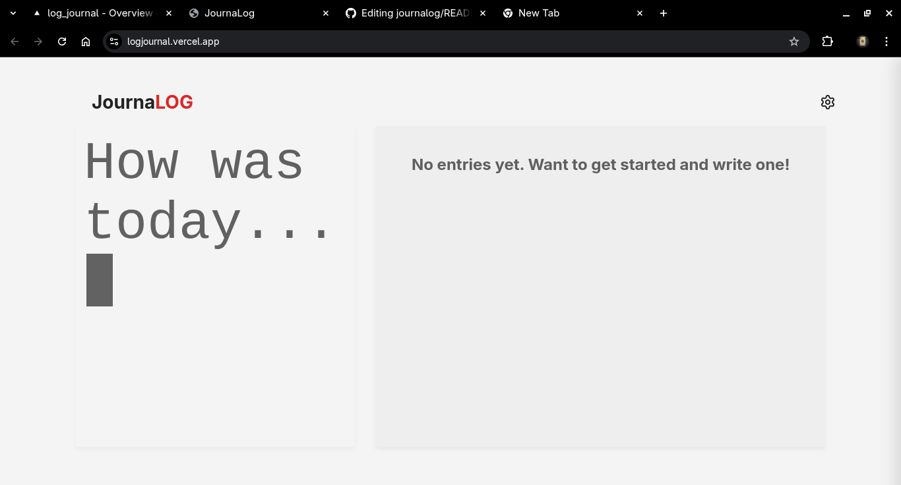

# 📔 JournaLOG

A minimalist, offline-first personal journaling application built with **React**, **TypeScript**, and **Vite**. 

Designed with privacy in mind, **JournalLOG** stores all your data locally in your browser. No servers, no accounts, no tracking. Just you and your thoughts.

[preview:](https://logjournal.vercel.app/)


## ✨ Features

* **🔒 100% Private & Offline:** Data is stored in your browser's `localStorage`. It never leaves your device.
* **🌓 Dark & Light Mode:** A fully themed UI that respects your eyes. Preferences are saved automatically.
* **💾 Data Ownership:** Full Backup & Restore functionality via JSON files. Move your data between devices easily.
* **📱 Fully Responsive:** A mobile-first design that adapts perfectly to desktop layouts.
* **🎨 Custom UI:**
    * **Typing Animation:** A dynamic entry trigger that invites you to write.
    * **Settings Drawer:** A clean slide-out menu for secondary actions.
    * **Distraction-Free Writing:** Modal-based writing interface.

## 📸 Screenshots

| Light Mode | Dark Mode |
|:---:|:---:|
|  |  |

## 🛠️ Tech Stack

* **Frontend Framework:** [React](https://reactjs.org/) (v18+)
* **Language:** [TypeScript](https://www.typescriptlang.org/)
* **Build Tool:** [Vite](https://vitejs.dev/)
* **Styling:** Pure CSS with CSS Variables (No heavy UI frameworks).
* **Icons:** [Lucide React](https://lucide.dev/)

## 🚀 Getting Started

Follow these steps to get a local copy up and running.

### Prerequisites

* Node.js (v16 or higher)
* npm

### Installation

1.  **Clone the repository**
    ```bash
    git clone https://github.com/rogx1ne/journalog.git
    cd journalog
    ```

2.  **Install dependencies**
    ```bash
    npm install
    ```

3.  **Run the development server**
    ```bash
    npm run dev
    ```

4.  Open your browser and visit `http://localhost:5173`.

## 📖 How to Use

### Writing an Entry
Click the box with the **typing animation** on the left (or top on mobile). A modal will open where you can focus entirely on writing.

### Managing Data (Import/Export)
Click the **Gear Icon (⚙️)** in the top right corner to open the **Settings Drawer**.
* **Export:** Downloads a `.json` file containing all your entries. Keep this safe!
* **Import:** Restores entries from a backup file. *Note: This overwrites current data.*

## 📂 Project Structure

```text
src/
├── components/
│   ├── EntryForm.tsx       # The form logic inside the modal
│   ├── EntryList.tsx       # Displays the scrollable list of entries
│   ├── EntryModal.tsx      # Popup for viewing/deleting entries
│   ├── NewEntryModal.tsx   # Popup wrapper for creating entries
│   ├── Header.tsx          # Top bar with title and settings trigger
│   ├── SettingsDrawer.tsx  # Slide-out panel for Theme & Data controls
│   ├── ThemeToggle.tsx     # The Light/Dark switch component
│   └── TypingAnimation.tsx # The animated cursor effect
├── types.ts                # TypeScript interfaces (JournalEntry)
├── App.css                 # CSS Variables and Global Styles
├── App.tsx                 # Main Application Logic & State
└── main.tsx                # Entry point
